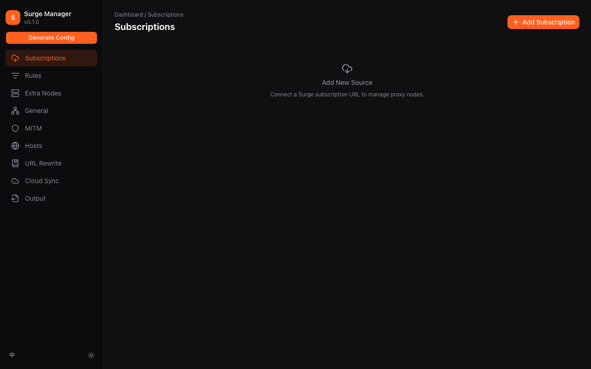
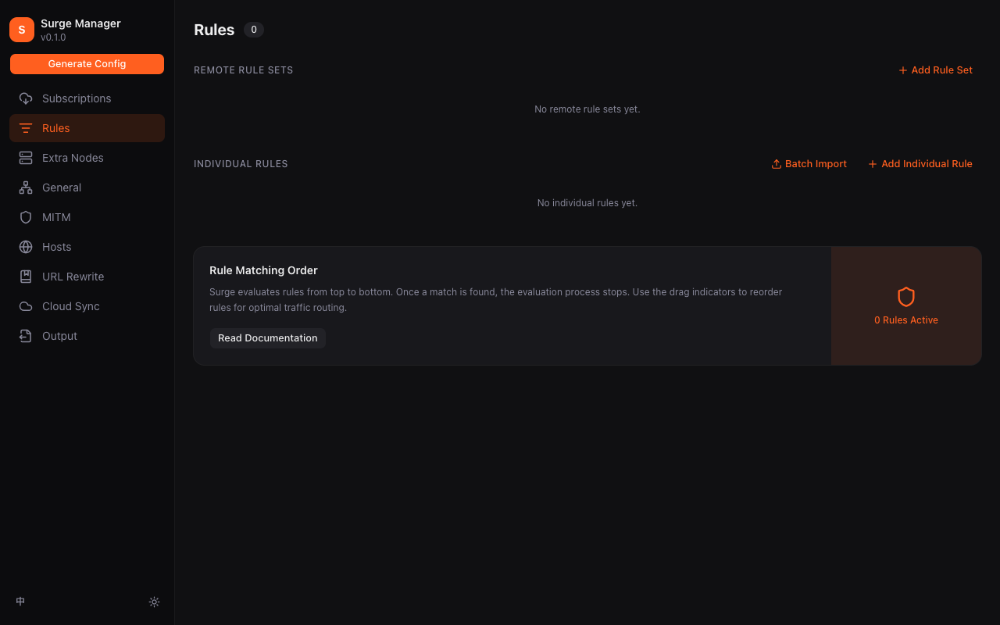
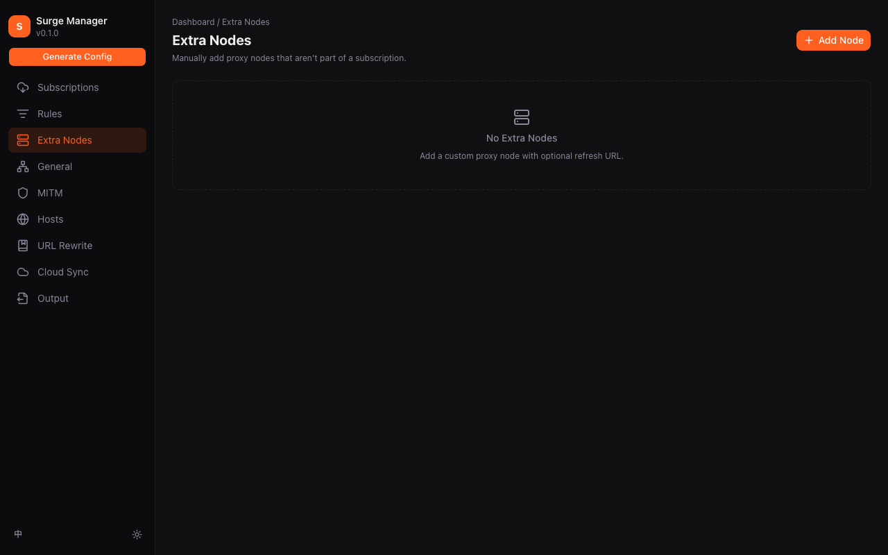
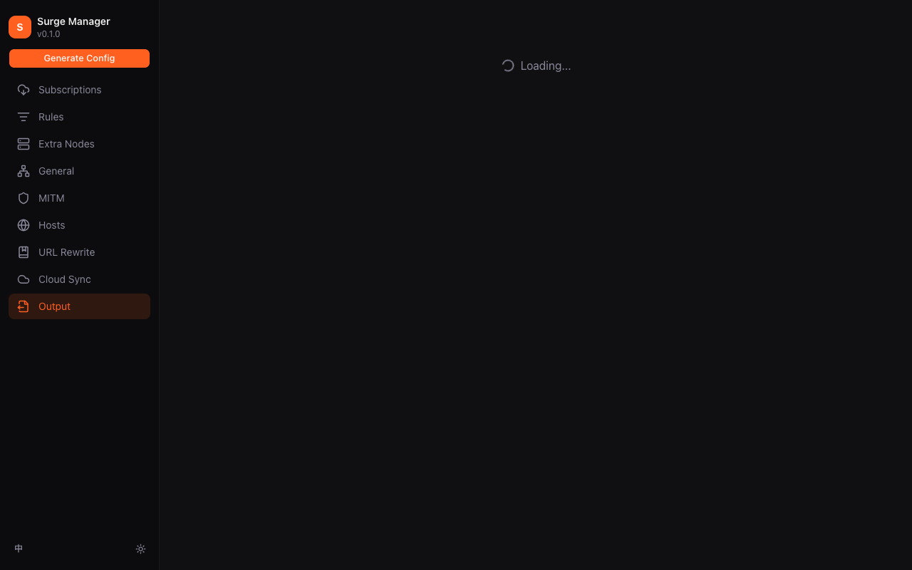
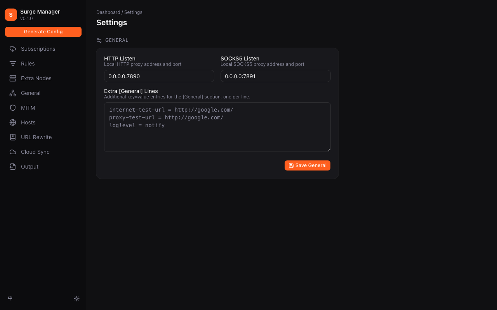
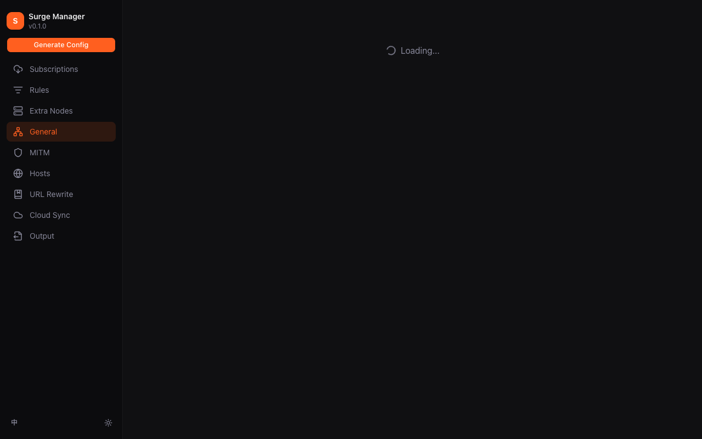
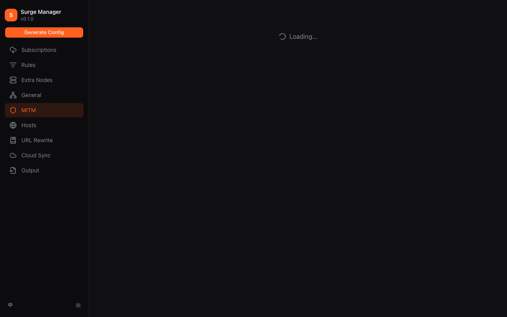
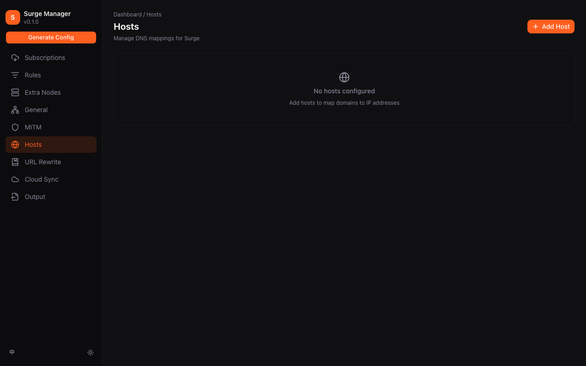
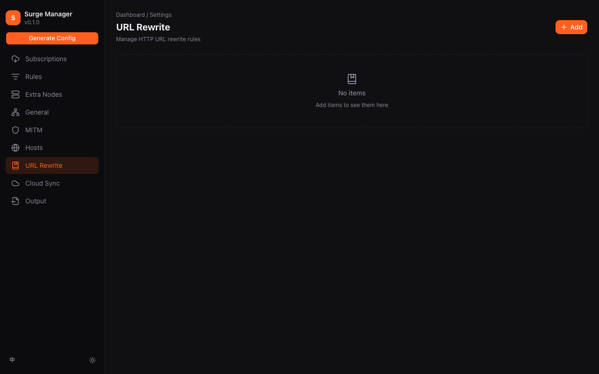
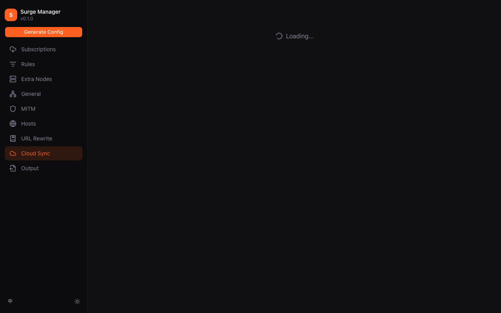

# Surge 配置管理器 - 用户指南

> 本文档面向最终用户，详细介绍 Surge 配置管理器（SCM）的各项功能。
> 截图保存于本地 `/tmp/` 目录，未包含任何敏感信息。

## 目录

1. [简介](#简介)
2. [订阅管理](#订阅管理)
3. [规则管理](#规则管理)
4. [额外节点（自定义节点）](#额外节点自定义节点)
5. [输出配置](#输出配置)
6. [设置页面](#设置页面)
   - [HTTP 监听](#http-监听)
   - [MITM](#mitm)
   - [HOST](#host)
   - [URL Rewrite](#url-rewrite)
   - [云同步](#云同步)
7. [重点功能详解](#重点功能详解)

---

## 简介

Surge 配置管理器是一款 macOS 原生桌面应用，帮助您可视化地管理 Surge 代理配置。主要功能包括：

- **订阅管理** - 导入和管理代理订阅
- **规则管理** - 管理路由规则和规则集
- **额外节点** - 添加自定义代理节点
- **输出配置** - 生成最终配置文件
- **高级设置** - HTTP 监听、MITM、HOST、URL 重写
- **云同步** - 将配置同步到 GitHub

---

## 订阅管理



订阅管理页面让您导入和管理代理订阅列表。

### 功能特点

| 功能 | 说明 |
|------|------|
| **添加订阅** | 支持两种方式：URL 远程订阅或本地 `.conf` 文件 |
| **自动刷新** | 自动获取最新节点信息 |
| **过期保护** | 刷新失败时保留原有配置，避免配置丢失 |
| **流量统计** | 显示订阅使用量（已用/总量）和过期时间 |

### 支持的订阅格式

- Surge 格式的 `.conf` 配置文件
- 包含 `[Proxy]` 和 `[Proxy Group]` 节点定义的文件
- 自动提取中英文流量信息（"当前流量：366.64G / 1000.00G" 或类似格式）

---

## 规则管理



规则管理页面让您配置代理的路由策略。

### 功能特点

| 功能 | 说明 |
|------|------|
| **远程规则集** | 添加远程 RULE-SET URL |
| **自定义规则** | 添加个别路由规则 |
| **拖拽排序** | 拖动规则调整优先级 |
| **快速操作** | 一键启用/禁用单个规则 |

### 规则类型

- `DOMAIN` - 域名匹配
- `DOMAIN-SUFFIX` - 域名后缀匹配
- `DOMAIN-KEYWORD` - 域名关键词匹配
- `URL-REGEX` - URL 正则匹配
- `IP-CIDR` - IP 段匹配
- `GEOIP` - 地理位置匹配
- `FINAL` - 默认策略

---

## 额外节点（自定义节点）



**这是本应用的重点功能之一**，让您添加不属于任何订阅的自定义代理节点。

### 功能特点

| 功能 | 说明 |
|------|------|
| **添加节点** | 手动输入节点信息（支持 SOCKS5、HTTP 等协议） |
| **节点名称** | 自定义显示名称 |
| **节点地址** | 支持域名和 IP 地址 |
| **端口号** | 自定义端口 |
| **用户名/密码** | 支持认证 |
| **删除节点** | 移除不再需要的节点 |

### 节点类型支持

- SOCKS5 代理
- HTTP/HTTPS 代理
- 支持用户名密码认证
- 支持 TLS 加密

### 使用场景

- 添加私人代理服务器
- 添加工作环境专用节点
- 添加游戏加速器节点
- 测试特定代理服务

### 操作示例

```
1. 点击「添加节点」按钮
2. 填写节点信息：
   - 名称：我的私人代理
   - 类型：SOCKS5
   - 地址：proxy.example.com
   - 端口：1080
   - 用户名：myuser
   - 密码：mypassword
3. 点击确认保存
```

---

## 输出配置



输出配置页面将所有设置合并生成最终的 Surge 配置文件。

### 功能特点

| 功能 | 说明 |
|------|------|
| **配置预览** | 查看生成配置文件的完整内容 |
| **差异对比** | 与上次生成的文件对比，查看变更 |
| **写入配置** | 将配置写入 Surge 配置目录 |
| **构建历史** | 查看历史生成记录 |

### 输出内容

生成的文件包含：

- 订阅中的所有代理节点
- 额外节点（自定义节点）
- 代理组配置
- 路由规则
- 规则集引用
- Host 配置（可选）
- URL Rewrite 配置（可选）
- MITM 配置（可选）

---

## 设置页面

点击左侧「设置」进入设置中心，包含多个高级配置模块。

### 设置主页



设置主页显示所有可用的设置模块入口。

---

### HTTP 监听



配置 HTTP 代理监听设置。

### 功能特点

| 功能 | 说明 |
|------|------|
| **启用/禁用** | 开关 HTTP 监听 |
| **监听地址** | 配置绑定地址（默认 127.0.0.1） |
| **端口设置** | 自定义监听端口 |
| **身份验证** | 可选的用户名密码认证 |

---

### MITM



配置 HTTPS 中间人（Man-in-the-Middle）解密功能。

### 功能特点

| 功能 | 说明 |
|------|------|
| **启用/禁用** | 开关 MITM 功能 |
| **证书管理** | 生成和管理 MITM 证书 |
| **域名过滤** | 只对指定域名进行 MITM |
| **跳过证书验证** | 可选的跳过证书验证选项 |

### 使用注意

- 需要信任 MITM CA 证书
- 仅在需要调试 HTTPS 流量时启用

---

### HOST



管理自定义 DNS 解析规则。

### 功能特点

| 功能 | 说明 |
|------|------|
| **添加规则** | 添加域名到 IP 的映射 |
| **批量添加** | 支持一次性添加多条规则 |
| **编辑规则** | 修改现有规则 |
| **删除规则** | 移除不需要的规则 |

### 规则格式

```
example.com = 1.2.3.4
api.example.com = 5.6.7.8
*.wildcard.example.com = 9.10.11.12
```

### 使用场景

- 开发环境本地解析
- 广告域名屏蔽
- 企业内网域名解析

---

### URL Rewrite



配置 URL 重写规则，修改网络请求的 URL。

### 功能特点

| 功能 | 说明 |
|------|------|
| **添加规则** | 创建 URL 重写规则 |
| **规则类型** | 支持多种匹配类型 |
| **重定向目标** | 设置重写后的目标 URL |
| **启用/禁用** | 单独控制每条规则 |

### 规则类型

| 类型 | 说明 | 示例 |
|------|------|------|
| `URL` | 完整 URL 匹配 | `^https://old.com/path$` |
| `HOST` | 仅匹配域名 | `^old\.com$` |
| `HEADER` | 修改响应头 | 添加/删除 HTTP 头 |

### 重写类型

- **302 重定向** - 临时重定向
- **307 重定向** - 临时重定向（保留方法）
- **301 重定向** - 永久重定向
- **Reject** - 拒绝请求
- **URL 修改** - 修改后的完整 URL

---

### 云同步



**这是本应用的重点功能之一**，将您的配置同步到 GitHub Gist，实现多设备同步。

#### 功能特点

| 功能 | 说明 |
|------|------|
| **连接 GitHub** | 使用 Personal Access Token 连接 GitHub |
| **自动同步** | 将配置自动同步到 GitHub Gist |
| **手动同步** | 支持手动触发同步 |
| **冲突处理** | 自动处理多设备修改冲突 |
| **同步状态** | 显示当前同步状态和最后同步时间 |

#### 设置步骤

1. **创建 GitHub Personal Access Token**

   - 访问 GitHub → Settings → Developer settings → Personal access tokens
   - 生成新令牌，勾选 `gist` 权限
   - 复制令牌

2. **在应用中添加令牌**

   - 打开「云同步」页面
   - 点击「添加令牌」
   - 粘贴 GitHub 令牌
   - 输入 Gist 描述（如 "Surge Config"）

3. **配置同步**

   - 选择要同步的内容类型
   - 点击「同步」按钮
   - 首次同步会创建新的 Gist

#### 同步内容

云同步会保存以下数据：

- 订阅信息（不包括实际节点内容）
- 额外节点配置
- 规则配置
- HOST 规则
- URL Rewrite 规则
- MITM 配置
- HTTP 监听配置

#### 多设备使用

1. 在新设备上安装 Surge 配置管理器
2. 进入「云同步」页面
3. 使用相同的 GitHub 令牌登录
4. 点击「从云端恢复」下载配置

---

## 重点功能详解

### 自定义节点 vs 订阅节点

| 对比项 | 订阅节点 | 自定义节点（额外节点） |
|--------|----------|----------------------|
| 来源 | 远程订阅 URL | 手动添加 |
| 更新方式 | 自动刷新 | 手动管理 |
| 适合场景 | 机场服务、公共节点 | 私人代理、特殊需求 |
| 数量 | 通常较多 | 按需添加 |
| 隐私性 | 信息在订阅服务器 | 仅本地存储 |

### 云同步的优势

1. **多设备同步** - 在 MacBook、iMac 等设备间同步配置
2. **数据备份** - 配置安全存储在 GitHub
3. **换机无忧** - 重装系统后可快速恢复
4. **团队共享** - 可将 Gist ID 分享给团队成员

### 最佳实践

#### 订阅管理

- 建议为每个订阅设置有意义的名称
- 开启自动刷新并设置合理间隔
- 留意流量使用情况，避免超额

#### 自定义节点

- 定期检查节点可用性
- 节点失效后及时删除
- 避免在多个地方重复添加同一节点

#### 云同步

- 首次使用先在本地完成基础配置
- 确认配置正常后再启用云同步
- 定期检查同步状态
- 更换设备时先确认云端数据最新

---

## 常见问题

### Q: 刷新订阅失败怎么办？

A: 应用有过期保护机制，刷新失败时会保留原有配置。可以检查：
- 网络连接是否正常
- 订阅 URL 是否有效
- 订阅是否需要认证

### Q: 如何导出配置？

A: 在「输出」页面点击「预览」查看完整配置，点击「写入配置」保存到 Surge 目录。

### Q: 云同步的令牌在哪里获取？

A: 访问 https://github.com/settings/tokens ，生成新的 Personal Access Token，勾选 `gist` 权限。

### Q: 额外节点和订阅节点有什么区别？

A: 订阅节点来自远程服务器，适合使用公共代理服务；额外节点是您手动添加的，适合私人代理或特殊需求。

---

## 界面预览

| 页面 | 截图文件 |
|------|----------|
| 订阅管理 | `01-subscriptions.png` |
| 规则管理 | `02-rules.png` |
| 额外节点 | `03-extranodes.png` |
| 输出配置 | `04-output.png` |
| 设置主页 | `05-settings-main.png` |
| HTTP 监听 | `06-http-listen.png` |
| MITM | `07-mitm.png` |
| HOST | `08-hosts.png` |
| URL Rewrite | `09-url-rewrites.png` |
| 云同步 | `10-cloud-sync.png` |

---

*本文档最后更新于 2026-03-30*
